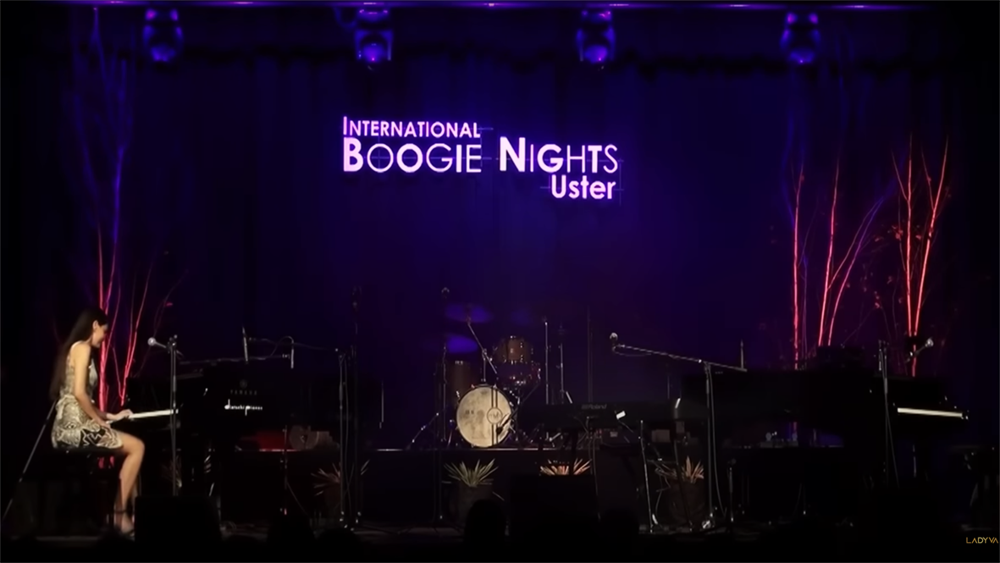

# Individual Work major-project-xshi0520 

## Instructions
- Move the mouse slowly across the screen to explore the artwork.
- Click the play/pause button to listen to the music and watch the animation.
- Hover over different screen areas to adjust the volume and change the music's position.
- Click on the circles to erase it.

## Details
I selected the **audio** approach. 
1. During the animation, the *square sizes* and circle *colors* change dynamically according to the audio. Additional geometric elements, like the mask and colorful circles, enhance the composition. The animation responds to audio using the *Fast Fourier Transform (FFT)* method.

2. The inspiration comes from the **stage performances** of boogie-woogie music, which influenced Piet Mondrian’s work.
 - 
 - [Stage performance](https://www.youtube.com/watch?v=OzSypP3jki8)
 - I added abstract elements, such as the mask and circles, to represent stage curtains and lights. Volume and panning adjustments represent the feeling of a live performance, and the act of erasing the mask is intended to create a more engaging experience.

3. - Based on the group code, I switched the RGB color mode to *HSL*, allowing for easier color adjustments by modifying a single variable, while keeping hue, saturation, and lightness aligned with the artwork’s colors. I resized the squares from the original code and added a mask and a set of circles. 
   - I used the `createGraphics()` function in p5.js to create a red mask graphic, symbolizing stage curtains.
```
          maskGraphics.erase(); 
          maskGraphics.circle(mouseX, mouseY, 50); 
          maskGraphics.noErase(); 
```
   - [createGraphics()](https://p5js.org/reference/p5/createGraphics/)
  
